I build production-grade web applications and backend systems, then push further and ship LLM-powered products on top of them - retrieval-augmented generation, semantic search, and agentic pipelines. Comfortable end-to-end: Angular/React on the front, Spring Boot/FastAPI/.NET on the back, LangChain/Google Gemini API for the AI layer.

 

---

### 🔭 What I'm doing

- Building enterprise-scale ETL pipelines and reporting systems (T-SQL, Azure Data Factory, Snowflake) in a **banking & financial services** environment.
- Shipping side projects around **Retrieval-Augmented Generation, semantic search, and LLM orchestration** with LangChain and Google Gemini API.
- Always up for a good conversation about system design, AI engineering, or interesting problems worth solving - feel free to reach out.

---

### 🧰 Tech Stack

**Languages:**

**Frontend & Backend:**

**AI / ML:**

**Data & Infra:**

---

### 🚀 Featured Projects

<b>📄 One-line summary of each project</b> (click to expand)

 

- **E-KYC Portal** - Secure enterprise KYC platform for insurance: search or create client KYC records, with document upload and route-guarded auth. `Angular` `Node.js` `Express` `PostgreSQL`
- **Employee Manager Application** - Full-stack CRUD app for employee records with a layered REST API. `Angular` `Spring Boot` `MySQL`
- **Log Classification System** - Hybrid log classifier that routes logs through RegEx, BERT embeddings, or an LLM depending on complexity, served via FastAPI. `FastAPI` `Sentence-Transformers` `LangChain` `Google Gemini API`
- **Medical Chatbot (RAG)** - RAG chatbot answering medical questions grounded in ingested PDFs, deployed via Docker with CI/CD. `Flask` `LangChain` `Pinecone` `Google Gemini API`
- **Generative-AI Projects** - Two GenAI apps: source-cited news research RAG, and a natural-language-to-SQL assistant. `Streamlit` `LangChain` `FAISS` `Google Gemini API`

---

### 🧩 Competitive Programming

---

### 📈 GitHub Activity

<picture>
  <source media="(prefers-color-scheme: dark)" srcset="https://raw.githubusercontent.com/arnavmaheshwari/arnavmaheshwari/output/github-contribution-grid-snake-dark.svg" />
  <source media="(prefers-color-scheme: light)" srcset="https://raw.githubusercontent.com/arnavmaheshwari/arnavmaheshwari/output/github-contribution-grid-snake.svg" />
  
</picture>

  

---

### 📝 Publications

- **Enhancing Air Quality Index Predictions with Machine Learning and SHAP Explanations** - Accepted, IEEE ICCCNT (16th edition)
- **A Comparison Study of Tools, Frameworks, and Libraries in NLP** - Book chapter, *Cognitive Connections* ([DOI](https://doi.org/10.52305/AAML7712))
- **Towards Precision Medicine: ML-Enhanced Data Analysis for Heart Failure Prediction** - Article, *IJASEAT Journal* ([Article](http://iraj.in/journal/IJASEAT//paper_detail.php?paper_id=21459&nameTowards_Precision_Medicine:_Machine_Learning-Enhanced_Data_Analysis_for_Heart_Failure_Prediction))

---

📫 Let's connect - **arnavmaheshwari2003@gmail.com** · **[LinkedIn](https://www.linkedin.com/in/arnav-maheshwari)**

